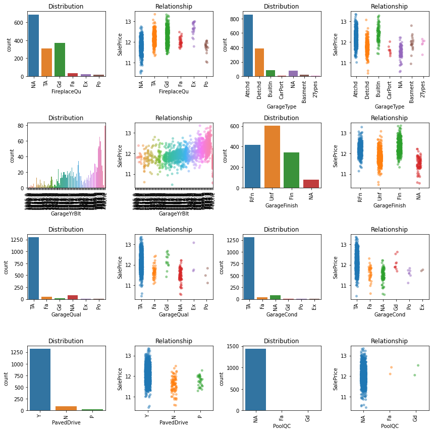
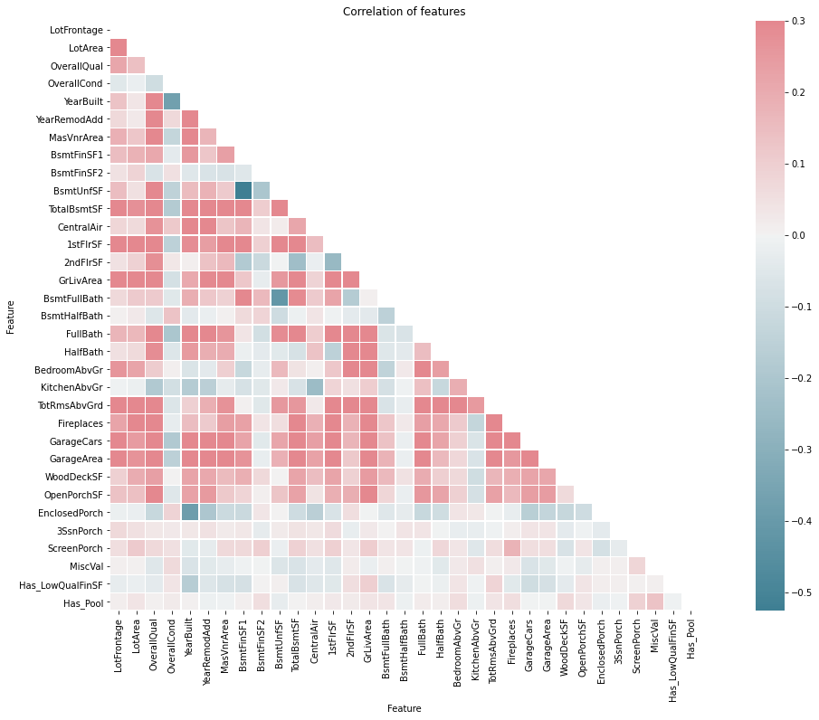

# House Prices - Advanced Regression Techniques

## James Morgan (jhmmorgan)
*2021-10-18*

### 1. Set Up
##### 1.1 Import Libraries


```python
import pandas as pd
import numpy as np
import math

# Use this cell to begin, and add as many cells as you need to complete your analysis!
# Libaries
import matplotlib.pyplot as plt
import seaborn as sns

# Statistics
from scipy import stats
from scipy.special import boxcox, inv_boxcox
#from scipy.stats import norm

from sklearn.preprocessing import LabelEncoder
from sklearn.preprocessing import StandardScaler

from sklearn.model_selection import train_test_split, cross_val_score, GridSearchCV, KFold
from sklearn.ensemble import RandomForestRegressor, AdaBoostRegressor, BaggingRegressor, ExtraTreesRegressor, GradientBoostingRegressor
from sklearn.linear_model import LassoCV, LinearRegression, RidgeCV

from sklearn.metrics import mean_absolute_error as MAE
from sklearn.metrics import mean_squared_error as MSE
from sklearn.metrics import mean_squared_log_error as MSLE

```

##### 1.2 Default classes
Used for better printing outputs.


```python
class color:
   PURPLE = '\033[95m'
   CYAN = '\033[96m'
   DARKCYAN = '\033[36m'
   BLUE = '\033[94m'
   GREEN = '\033[92m'
   YELLOW = '\033[93m'
   RED = '\033[91m'
   BOLD = '\033[1m'
   UNDERLINE = '\033[4m'
   END = '\033[0m'
```

##### 1.3 Load Data
Lets read in the data...

However, before we do, the data description shows NA as being a valid value for many of the categories
Normally meaning none, i.e. Alley == NA means no alley access, not missing data. We'll therefore override the default NA's to ignore "NA" from the NA list.


```python
# Get the default NA values from Pandas and remove "NA". Use this as the default list of NA's
_na_values = ['-1.#IND', '1.#QNAN', '1.#IND', '-1.#QNAN', '#N/A N/A', '#N/A', 'N/A', 'n/a', '<NA>', '#NA', 'NULL', 'null', 'NaN', '-NaN', 'nan', '-nan', '']

# Now we can read the files
src_path      = "house-prices-advanced-regression-techniques/"
test_df       = pd.read_csv(src_path + "test.csv", keep_default_na = True)#, na_values = _na_values)
train_df      = pd.read_csv(src_path + "train.csv", keep_default_na = True)#, na_values = _na_values)
sample_sub_df = pd.read_csv(src_path + "sample_submission.csv")

train_df.head()
```


<div>
<style scoped>
    .dataframe tbody tr th:only-of-type {
        vertical-align: middle;
    }

    .dataframe tbody tr th {
        vertical-align: top;
    }

    .dataframe thead th {
        text-align: right;
    }
</style>
<table border="1" class="dataframe">
  <thead>
    <tr style="text-align: right;">
      <th></th>
      <th>Id</th>
      <th>MSSubClass</th>
      <th>MSZoning</th>
      <th>LotFrontage</th>
      <th>LotArea</th>
      <th>Street</th>
      <th>Alley</th>
      <th>LotShape</th>
      <th>LandContour</th>
      <th>Utilities</th>
      <th>...</th>
      <th>PoolArea</th>
      <th>PoolQC</th>
      <th>Fence</th>
      <th>MiscFeature</th>
      <th>MiscVal</th>
      <th>MoSold</th>
      <th>YrSold</th>
      <th>SaleType</th>
      <th>SaleCondition</th>
      <th>SalePrice</th>
    </tr>
  </thead>
  <tbody>
    <tr>
      <th>0</th>
      <td>1</td>
      <td>60</td>
      <td>RL</td>
      <td>65.0</td>
      <td>8450</td>
      <td>Pave</td>
      <td>NaN</td>
      <td>Reg</td>
      <td>Lvl</td>
      <td>AllPub</td>
      <td>...</td>
      <td>0</td>
      <td>NaN</td>
      <td>NaN</td>
      <td>NaN</td>
      <td>0</td>
      <td>2</td>
      <td>2008</td>
      <td>WD</td>
      <td>Normal</td>
      <td>208500</td>
    </tr>
    <tr>
      <th>1</th>
      <td>2</td>
      <td>20</td>
      <td>RL</td>
      <td>80.0</td>
      <td>9600</td>
      <td>Pave</td>
      <td>NaN</td>
      <td>Reg</td>
      <td>Lvl</td>
      <td>AllPub</td>
      <td>...</td>
      <td>0</td>
      <td>NaN</td>
      <td>NaN</td>
      <td>NaN</td>
      <td>0</td>
      <td>5</td>
      <td>2007</td>
      <td>WD</td>
      <td>Normal</td>
      <td>181500</td>
    </tr>
    <tr>
      <th>2</th>
      <td>3</td>
      <td>60</td>
      <td>RL</td>
      <td>68.0</td>
      <td>11250</td>
      <td>Pave</td>
      <td>NaN</td>
      <td>IR1</td>
      <td>Lvl</td>
      <td>AllPub</td>
      <td>...</td>
      <td>0</td>
      <td>NaN</td>
      <td>NaN</td>
      <td>NaN</td>
      <td>0</td>
      <td>9</td>
      <td>2008</td>
      <td>WD</td>
      <td>Normal</td>
      <td>223500</td>
    </tr>
    <tr>
      <th>3</th>
      <td>4</td>
      <td>70</td>
      <td>RL</td>
      <td>60.0</td>
      <td>9550</td>
      <td>Pave</td>
      <td>NaN</td>
      <td>IR1</td>
      <td>Lvl</td>
      <td>AllPub</td>
      <td>...</td>
      <td>0</td>
      <td>NaN</td>
      <td>NaN</td>
      <td>NaN</td>
      <td>0</td>
      <td>2</td>
      <td>2006</td>
      <td>WD</td>
      <td>Abnorml</td>
      <td>140000</td>
    </tr>
    <tr>
      <th>4</th>
      <td>5</td>
      <td>60</td>
      <td>RL</td>
      <td>84.0</td>
      <td>14260</td>
      <td>Pave</td>
      <td>NaN</td>
      <td>IR1</td>
      <td>Lvl</td>
      <td>AllPub</td>
      <td>...</td>
      <td>0</td>
      <td>NaN</td>
      <td>NaN</td>
      <td>NaN</td>
      <td>0</td>
      <td>12</td>
      <td>2008</td>
      <td>WD</td>
      <td>Normal</td>
      <td>250000</td>
    </tr>
  </tbody>
</table>
<p>5 rows × 81 columns</p>
</div>


```python
# Using Ids as Indexes
for df in [train_df, test_df]:
    df.set_index("Id", inplace=True)
train_df.head()
```


<div>
<style scoped>
    .dataframe tbody tr th:only-of-type {
        vertical-align: middle;
    }

    .dataframe tbody tr th {
        vertical-align: top;
    }

    .dataframe thead th {
        text-align: right;
    }
</style>
<table border="1" class="dataframe">
  <thead>
    <tr style="text-align: right;">
      <th></th>
      <th>MSSubClass</th>
      <th>MSZoning</th>
      <th>LotFrontage</th>
      <th>LotArea</th>
      <th>Street</th>
      <th>Alley</th>
      <th>LotShape</th>
      <th>LandContour</th>
      <th>Utilities</th>
      <th>LotConfig</th>
      <th>...</th>
      <th>PoolArea</th>
      <th>PoolQC</th>
      <th>Fence</th>
      <th>MiscFeature</th>
      <th>MiscVal</th>
      <th>MoSold</th>
      <th>YrSold</th>
      <th>SaleType</th>
      <th>SaleCondition</th>
      <th>SalePrice</th>
    </tr>
    <tr>
      <th>Id</th>
      <th></th>
      <th></th>
      <th></th>
      <th></th>
      <th></th>
      <th></th>
      <th></th>
      <th></th>
      <th></th>
      <th></th>
      <th></th>
      <th></th>
      <th></th>
      <th></th>
      <th></th>
      <th></th>
      <th></th>
      <th></th>
      <th></th>
      <th></th>
      <th></th>
    </tr>
  </thead>
  <tbody>
    <tr>
      <th>1</th>
      <td>60</td>
      <td>RL</td>
      <td>65.0</td>
      <td>8450</td>
      <td>Pave</td>
      <td>NaN</td>
      <td>Reg</td>
      <td>Lvl</td>
      <td>AllPub</td>
      <td>Inside</td>
      <td>...</td>
      <td>0</td>
      <td>NaN</td>
      <td>NaN</td>
      <td>NaN</td>
      <td>0</td>
      <td>2</td>
      <td>2008</td>
      <td>WD</td>
      <td>Normal</td>
      <td>208500</td>
    </tr>
    <tr>
      <th>2</th>
      <td>20</td>
      <td>RL</td>
      <td>80.0</td>
      <td>9600</td>
      <td>Pave</td>
      <td>NaN</td>
      <td>Reg</td>
      <td>Lvl</td>
      <td>AllPub</td>
      <td>FR2</td>
      <td>...</td>
      <td>0</td>
      <td>NaN</td>
      <td>NaN</td>
      <td>NaN</td>
      <td>0</td>
      <td>5</td>
      <td>2007</td>
      <td>WD</td>
      <td>Normal</td>
      <td>181500</td>
    </tr>
    <tr>
      <th>3</th>
      <td>60</td>
      <td>RL</td>
      <td>68.0</td>
      <td>11250</td>
      <td>Pave</td>
      <td>NaN</td>
      <td>IR1</td>
      <td>Lvl</td>
      <td>AllPub</td>
      <td>Inside</td>
      <td>...</td>
      <td>0</td>
      <td>NaN</td>
      <td>NaN</td>
      <td>NaN</td>
      <td>0</td>
      <td>9</td>
      <td>2008</td>
      <td>WD</td>
      <td>Normal</td>
      <td>223500</td>
    </tr>
    <tr>
      <th>4</th>
      <td>70</td>
      <td>RL</td>
      <td>60.0</td>
      <td>9550</td>
      <td>Pave</td>
      <td>NaN</td>
      <td>IR1</td>
      <td>Lvl</td>
      <td>AllPub</td>
      <td>Corner</td>
      <td>...</td>
      <td>0</td>
      <td>NaN</td>
      <td>NaN</td>
      <td>NaN</td>
      <td>0</td>
      <td>2</td>
      <td>2006</td>
      <td>WD</td>
      <td>Abnorml</td>
      <td>140000</td>
    </tr>
    <tr>
      <th>5</th>
      <td>60</td>
      <td>RL</td>
      <td>84.0</td>
      <td>14260</td>
      <td>Pave</td>
      <td>NaN</td>
      <td>IR1</td>
      <td>Lvl</td>
      <td>AllPub</td>
      <td>FR2</td>
      <td>...</td>
      <td>0</td>
      <td>NaN</td>
      <td>NaN</td>
      <td>NaN</td>
      <td>0</td>
      <td>12</td>
      <td>2008</td>
      <td>WD</td>
      <td>Normal</td>
      <td>250000</td>
    </tr>
  </tbody>
</table>
<p>5 rows × 80 columns</p>
</div>


### 2. EDA (Exploratory Data Analysis)
###### 2.1 Data Check


```python
# Data Type Check
df = pd.DataFrame({"Column": train_df.columns, "Dtype": train_df.dtypes.astype("str").tolist(), 
                   "Sample1": train_df.loc[1].tolist(),
                   "Sample2": train_df.loc[50].tolist(), 
                   "Sample3": train_df.loc[500].tolist()})
print(color.BOLD + color.UNDERLINE + "Data Types for all features in the training data frame" + color.END)
print(df.to_string())
```

    Data Types for all features in the training data frame
               Column    Dtype  Sample1  Sample2  Sample3
    0      MSSubClass    int64       60       20       20
    1        MSZoning   object       RL       RL       RL
    2     LotFrontage  float64     65.0     66.0     70.0
    3         LotArea    int64     8450     7742     7535
    4          Street   object     Pave     Pave     Pave
    5           Alley   object      NaN      NaN      NaN
    6        LotShape   object      Reg      Reg      IR1
    7     LandContour   object      Lvl      Lvl      Lvl
    8       Utilities   object   AllPub   AllPub   AllPub
    9       LotConfig   object   Inside   Inside   Inside
    10      LandSlope   object      Gtl      Gtl      Gtl
    11   Neighborhood   object  CollgCr   Sawyer    NAmes
    12     Condition1   object     Norm     Norm     Norm
    13     Condition2   object     Norm     Norm     Norm
    14       BldgType   object     1Fam     1Fam     1Fam
    15     HouseStyle   object   2Story   1Story   1Story
    16    OverallQual    int64        7        5        5
    17    OverallCond    int64        5        7        7
    18      YearBuilt    int64     2003     1966     1958
    19   YearRemodAdd    int64     2003     1966     1985
    20      RoofStyle   object    Gable    Gable    Gable
    21       RoofMatl   object  CompShg  CompShg  CompShg
    22    Exterior1st   object  VinylSd  HdBoard  MetalSd
    23    Exterior2nd   object  VinylSd  HdBoard  MetalSd
    24     MasVnrType   object  BrkFace     None     None
    25     MasVnrArea  float64    196.0      0.0      0.0
    26      ExterQual   object       Gd       TA       TA
    27      ExterCond   object       TA       TA       TA
    28     Foundation   object    PConc   CBlock   CBlock
    29       BsmtQual   object       Gd       TA       TA
    30       BsmtCond   object       TA       TA       TA
    31   BsmtExposure   object       No       No       No
    32   BsmtFinType1   object      GLQ      BLQ      BLQ
    33     BsmtFinSF1    int64      706      763      111
    34   BsmtFinType2   object      Unf      Unf      LwQ
    35     BsmtFinSF2    int64        0        0      279
    36      BsmtUnfSF    int64      150      192      522
    37    TotalBsmtSF    int64      856      955      912
    38        Heating   object     GasA     GasA     GasA
    39      HeatingQC   object       Ex       Ex       Fa
    40     CentralAir   object        Y        Y        Y
    41     Electrical   object    SBrkr    SBrkr    SBrkr
    42       1stFlrSF    int64      856      955      912
    43       2ndFlrSF    int64      854        0        0
    44   LowQualFinSF    int64        0        0        0
    45      GrLivArea    int64     1710      955      912
    46   BsmtFullBath    int64        1        1        0
    47   BsmtHalfBath    int64        0        0        1
    48       FullBath    int64        2        1        1
    49       HalfBath    int64        1        0        0
    50   BedroomAbvGr    int64        3        3        2
    51   KitchenAbvGr    int64        1        1        1
    52    KitchenQual   object       Gd       TA       TA
    53   TotRmsAbvGrd    int64        8        6        5
    54     Functional   object      Typ      Typ      Typ
    55     Fireplaces    int64        0        0        0
    56    FireplaceQu   object      NaN      NaN      NaN
    57     GarageType   object   Attchd   Attchd   Attchd
    58    GarageYrBlt  float64   2003.0   1966.0   1958.0
    59   GarageFinish   object      RFn      Unf      Fin
    60     GarageCars    int64        2        1        1
    61     GarageArea    int64      548      386      297
    62     GarageQual   object       TA       TA       TA
    63     GarageCond   object       TA       TA       TA
    64     PavedDrive   object        Y        Y        Y
    65     WoodDeckSF    int64        0        0       12
    66    OpenPorchSF    int64       61        0      285
    67  EnclosedPorch    int64        0        0        0
    68      3SsnPorch    int64        0        0        0
    69    ScreenPorch    int64        0        0        0
    70       PoolArea    int64        0        0        0
    71         PoolQC   object      NaN      NaN      NaN
    72          Fence   object      NaN    MnPrv     MnWw
    73    MiscFeature   object      NaN      NaN     Shed
    74        MiscVal    int64        0        0      480
    75         MoSold    int64        2        1        6
    76         YrSold    int64     2008     2007     2007
    77       SaleType   object       WD       WD       WD
    78  SaleCondition   object   Normal   Normal   Normal
    79      SalePrice    int64   208500   127000   120000


###### Observations:
* **MSSubClass**, **MoSold**, **YrSold** are categorical, but stored as numbers
* **OverallQal**, **OverallCond** are also categorical, however with a scale of 1 to 10 so are ok to remain numbers
* **CentralAir** is a Y/N and so should be a boolean
* Various features have missing values, however **NA** was one of their options.

We need to change these in both the training and test datasets.

We'll first replace any null value in the specified columns to the string "NA":


```python
# Array of features with NA as a valid option
features_with_NA = ["Alley",
                    "BsmtQual",
                    "BsmtCond",
                    "BsmtExposure",
                    "BsmtFinType1",
                    "BsmtFinType2",
                    "FireplaceQu",
                    "GarageType",
                    "GarageFinish",
                    "GarageQual",
                    "GarageCond",
                    "PoolQC",
                    "Fence",
                    "MiscFeature"]

for feature in features_with_NA:
    for df in [train_df, test_df]:
        df.replace({feature: {np.NAN : "NA"}}, inplace=True)

train_df[features_with_NA].head()
```


<div>
<style scoped>
    .dataframe tbody tr th:only-of-type {
        vertical-align: middle;
    }

    .dataframe tbody tr th {
        vertical-align: top;
    }

    .dataframe thead th {
        text-align: right;
    }
</style>
<table border="1" class="dataframe">
  <thead>
    <tr style="text-align: right;">
      <th></th>
      <th>Alley</th>
      <th>BsmtQual</th>
      <th>BsmtCond</th>
      <th>BsmtExposure</th>
      <th>BsmtFinType1</th>
      <th>BsmtFinType2</th>
      <th>FireplaceQu</th>
      <th>GarageType</th>
      <th>GarageFinish</th>
      <th>GarageQual</th>
      <th>GarageCond</th>
      <th>PoolQC</th>
      <th>Fence</th>
      <th>MiscFeature</th>
    </tr>
    <tr>
      <th>Id</th>
      <th></th>
      <th></th>
      <th></th>
      <th></th>
      <th></th>
      <th></th>
      <th></th>
      <th></th>
      <th></th>
      <th></th>
      <th></th>
      <th></th>
      <th></th>
      <th></th>
    </tr>
  </thead>
  <tbody>
    <tr>
      <th>1</th>
      <td>NA</td>
      <td>Gd</td>
      <td>TA</td>
      <td>No</td>
      <td>GLQ</td>
      <td>Unf</td>
      <td>NA</td>
      <td>Attchd</td>
      <td>RFn</td>
      <td>TA</td>
      <td>TA</td>
      <td>NA</td>
      <td>NA</td>
      <td>NA</td>
    </tr>
    <tr>
      <th>2</th>
      <td>NA</td>
      <td>Gd</td>
      <td>TA</td>
      <td>Gd</td>
      <td>ALQ</td>
      <td>Unf</td>
      <td>TA</td>
      <td>Attchd</td>
      <td>RFn</td>
      <td>TA</td>
      <td>TA</td>
      <td>NA</td>
      <td>NA</td>
      <td>NA</td>
    </tr>
    <tr>
      <th>3</th>
      <td>NA</td>
      <td>Gd</td>
      <td>TA</td>
      <td>Mn</td>
      <td>GLQ</td>
      <td>Unf</td>
      <td>TA</td>
      <td>Attchd</td>
      <td>RFn</td>
      <td>TA</td>
      <td>TA</td>
      <td>NA</td>
      <td>NA</td>
      <td>NA</td>
    </tr>
    <tr>
      <th>4</th>
      <td>NA</td>
      <td>TA</td>
      <td>Gd</td>
      <td>No</td>
      <td>ALQ</td>
      <td>Unf</td>
      <td>Gd</td>
      <td>Detchd</td>
      <td>Unf</td>
      <td>TA</td>
      <td>TA</td>
      <td>NA</td>
      <td>NA</td>
      <td>NA</td>
    </tr>
    <tr>
      <th>5</th>
      <td>NA</td>
      <td>Gd</td>
      <td>TA</td>
      <td>Av</td>
      <td>GLQ</td>
      <td>Unf</td>
      <td>TA</td>
      <td>Attchd</td>
      <td>RFn</td>
      <td>TA</td>
      <td>TA</td>
      <td>NA</td>
      <td>NA</td>
      <td>NA</td>
    </tr>
  </tbody>
</table>
</div>


We'll now replace various integers to appropriate categories:


```python
for df in [train_df, test_df]:
    df.replace({"MSSubClass": {20: "SC20", 30: "SC30", 40: "SC40", 45: "SC45", 50: "SC50", 60: "SC60", 70: "SC70", 75: "SC75",
                               80: "SC80", 85: "SC85", 90: "SC90", 120: "SC120", 150: "SC150", 160: "SC160", 180: "SC180", 190: "SC190"}, 
                "MoSold": {1: "Jan", 2: "Feb", 3: "Mar", 4: "Apr", 5: "May", 6: "Jun",
                           7: "Jul", 8: "Aug", 9: "Sep", 10: "Oct", 11: "Nov", 12: "Dec"},
                "CentralAir": {"Y": True, "N": False}},
                inplace=True)
    df["YrSold"] = pd.Categorical(df.YrSold)

train_df[["MSSubClass", "YrSold", "MoSold", "CentralAir"]].head()
```


<div>
<style scoped>
    .dataframe tbody tr th:only-of-type {
        vertical-align: middle;
    }

    .dataframe tbody tr th {
        vertical-align: top;
    }

    .dataframe thead th {
        text-align: right;
    }
</style>
<table border="1" class="dataframe">
  <thead>
    <tr style="text-align: right;">
      <th></th>
      <th>MSSubClass</th>
      <th>YrSold</th>
      <th>MoSold</th>
      <th>CentralAir</th>
    </tr>
    <tr>
      <th>Id</th>
      <th></th>
      <th></th>
      <th></th>
      <th></th>
    </tr>
  </thead>
  <tbody>
    <tr>
      <th>1</th>
      <td>SC60</td>
      <td>2008</td>
      <td>Feb</td>
      <td>True</td>
    </tr>
    <tr>
      <th>2</th>
      <td>SC20</td>
      <td>2007</td>
      <td>May</td>
      <td>True</td>
    </tr>
    <tr>
      <th>3</th>
      <td>SC60</td>
      <td>2008</td>
      <td>Sep</td>
      <td>True</td>
    </tr>
    <tr>
      <th>4</th>
      <td>SC70</td>
      <td>2006</td>
      <td>Feb</td>
      <td>True</td>
    </tr>
    <tr>
      <th>5</th>
      <td>SC60</td>
      <td>2008</td>
      <td>Dec</td>
      <td>True</td>
    </tr>
  </tbody>
</table>
</div>


##### 2.2 Missing Values
We now need to review and clean any missing value.


```python
_train_df      = train_df.drop(columns = "SalePrice")
combined_df = pd.concat([_train_df, test_df])

print(color.BOLD + "Which features contain null values?" + color.END)
print(combined_df.isnull().sum()[combined_df.isnull().sum()>0])
```

    Which features contain null values?
    MSZoning          4
    LotFrontage     486
    Utilities         2
    Exterior1st       1
    Exterior2nd       1
    MasVnrType       24
    MasVnrArea       23
    BsmtFinSF1        1
    BsmtFinSF2        1
    BsmtUnfSF         1
    TotalBsmtSF       1
    Electrical        1
    BsmtFullBath      2
    BsmtHalfBath      2
    KitchenQual       1
    Functional        2
    GarageYrBlt     159
    GarageCars        1
    GarageArea        1
    SaleType          1
    dtype: int64


We can fill most of these in by looking at the data description by using defaults such as "Other" or "None.
The numeric values can have 0, such as those with square feet metrics.

**GarageYrBlt** contains a year, or is blank if there is no garage.  We can change this to a categorical feature.


```python
# Filling the Missing Values
MSZoning_series    = combined_df.groupby("Neighborhood").MSZoning.agg(lambda x:x.value_counts().index[0])
LotFrontage_series = combined_df.groupby("Neighborhood").LotFrontage.median()

combined_df_filled = combined_df.fillna({"Utilities": "AllPub",
                                         "Exterior1st":"Other",
                                         "Exterior2nd":"Other",
                                         "MasVnrType":"None",
                                         "MasVnrArea":0,
                                         "BsmtFinSF1":0,
                                         "BsmtFinSF2":0,
                                         "BsmtUnfSF":0,
                                         "TotalBsmtSF":0,
                                         "Electrical":"SBrkr",
                                         "BsmtFullBath":0,
                                         "BsmtHalfBath":0,
                                         "KitchenQual":"TA",
                                         "Functional":"Typ",
                                         "GarageYrBlt":"None",
                                         "GarageCars":0,
                                         "GarageArea":0,
                                         "SaleType":"Oth",
                                         "MSZoning": combined_df["Neighborhood"].apply(lambda x: MSZoning_series[x]),
                                         "LotFrontage": combined_df["Neighborhood"].apply(lambda x: LotFrontage_series[x])})


combined_df_filled["GarageYrBlt"] = pd.Categorical(combined_df_filled.GarageYrBlt)

print(color.BOLD + "Number of null values?" + color.END)
print(combined_df_filled.isnull().sum().sum())
```

    Number of null values?
    0


Fantastic! There are no null values.

We can now split the combined dataframe back into the train and test dataframes.


```python
train_df_filled = combined_df_filled.iloc[:len(train_df)]
train_df_filled = pd.concat([train_df_filled, train_df['SalePrice']], axis=1)
test_df_filled = combined_df_filled.iloc[len(train_df):]
```

##### 2.3 Visualisation of the data
###### 2.3.1. SalePrice
We now need to visualise the data.

**How evenly distributed is the sale price (target) in our training data?**


```python
# Figure
plt.figure(figsize=(12, 4))
plt.suptitle("Visualising the skewness of the SalePrice target variable")

# Distribution Plot
plt.subplot(1, 2, 1)
sns.histplot(train_df_filled["SalePrice"], stat = "density", kde = True)
plt.title('Distribution Plot')

# Probability Plot
plt.subplot(1, 2, 2)
stats.probplot(train_df_filled['SalePrice'], plot=plt)

plt.tight_layout()
plt.show()
plt.clf()
```


    

    


    <Figure size 432x288 with 0 Axes>


```python
skew_SalePrice   = train_df_filled.SalePrice.skew()
log1p_SalePrice  = np.log1p(train_df_filled.SalePrice).skew()
sqrt_SalePrice   = np.sqrt(train_df_filled.SalePrice).skew()
boxcox_SalePrice = pd.Series(boxcox(train_df_filled.SalePrice, 0)).skew()

skewed_results = pd.DataFrame({"Untransformed":[skew_SalePrice], 
                               "log1p":[log1p_SalePrice],
                               "Square Root": [sqrt_SalePrice],
                               "boxcox":[boxcox_SalePrice]})

print(color.BOLD + "Skewness of untransformed SalePrice target variable, vs various transformation techniques" + color.END)
print(skewed_results)
```

    Skewness of untransformed SalePrice target variable, vs various transformation techniques
       Untransformed     log1p  Square Root    boxcox
    0       1.882876  0.121347     0.943153  0.121335


The SalePrice appears skewed. A log1p transformation smooths this better than the square root.  The boxcox is only marginally better and personally less preferred.


```python
train_df_filled['SalePrice'] = np.log1p(train_df_filled.SalePrice)

# Figure
plt.figure(figsize=(12, 4))
plt.suptitle("Visualisaing the skewnewss of the SalePrice target variable following a log1p transformation")
# Distribution Plot
plt.subplot(1, 2, 1)
sns.histplot(train_df_filled["SalePrice"], stat = "density", kde = True)
plt.title('Distribution Plot')

# Probability Plot
plt.subplot(1, 2, 2)
stats.probplot(train_df_filled['SalePrice'], plot=plt)

plt.tight_layout()
plt.show()
plt.clf()
```


    

    


    <Figure size 432x288 with 0 Axes>


##### 2.3 Visualisation of the data
###### 2.3.2 Numerical and Categorical Features

We now need to visualise the numerical and categorical features.

* We want to extract the names of the numerical and categorical features
* We want to visualise the density and relationship of the numerical values against the SalePrice target variable.
    * We'll achieve this by producing an 4x4 grid of visualisation.
    * This gives us 16 subplots per plot.
    * We'll show 8 features per plot (each feature has two subplots)


```python
numerical_features = train_df_filled.select_dtypes(include = [np.number, bool]).columns
print(color.BOLD + f'Numerical Features ({len(numerical_features)}):' + color.END + f'\n{numerical_features}')
categorical_features = train_df_filled.select_dtypes(exclude = [np.number, bool]).columns
print(color.BOLD + f'Categorical Features ({len(categorical_features)}):' + color.END + f'\n{categorical_features}')
```

    Numerical Features (34):
    Index(['LotFrontage', 'LotArea', 'OverallQual', 'OverallCond', 'YearBuilt',
           'YearRemodAdd', 'MasVnrArea', 'BsmtFinSF1', 'BsmtFinSF2', 'BsmtUnfSF',
           'TotalBsmtSF', 'CentralAir', '1stFlrSF', '2ndFlrSF', 'LowQualFinSF',
           'GrLivArea', 'BsmtFullBath', 'BsmtHalfBath', 'FullBath', 'HalfBath',
           'BedroomAbvGr', 'KitchenAbvGr', 'TotRmsAbvGrd', 'Fireplaces',
           'GarageCars', 'GarageArea', 'WoodDeckSF', 'OpenPorchSF',
           'EnclosedPorch', '3SsnPorch', 'ScreenPorch', 'PoolArea', 'MiscVal',
           'SalePrice'],
          dtype='object')
    Categorical Features (46):
    Index(['MSSubClass', 'MSZoning', 'Street', 'Alley', 'LotShape', 'LandContour',
           'Utilities', 'LotConfig', 'LandSlope', 'Neighborhood', 'Condition1',
           'Condition2', 'BldgType', 'HouseStyle', 'RoofStyle', 'RoofMatl',
           'Exterior1st', 'Exterior2nd', 'MasVnrType', 'ExterQual', 'ExterCond',
           'Foundation', 'BsmtQual', 'BsmtCond', 'BsmtExposure', 'BsmtFinType1',
           'BsmtFinType2', 'Heating', 'HeatingQC', 'Electrical', 'KitchenQual',
           'Functional', 'FireplaceQu', 'GarageType', 'GarageYrBlt',
           'GarageFinish', 'GarageQual', 'GarageCond', 'PavedDrive', 'PoolQC',
           'Fence', 'MiscFeature', 'MoSold', 'YrSold', 'SaleType',
           'SaleCondition'],
          dtype='object')


```python
# We want to split the numerical and categorical features into groups to view the data better
# To do this, we'll group these in sets of 10

# How many groups are needed?
#  Each will be a 4x4 grid. Total of 16 charts per plot
#  Each plot will have two charts, total of 8 features per plot
numerical_groups   = math.ceil(len(numerical_features.values)/8)
categorical_groups = math.ceil(len(categorical_features.values)/8)

total_groups       = numerical_groups + categorical_groups

numerical_step     = 8
categorical_step   = 8

group_num = np.empty(int(numerical_groups), dtype = pd.Series)
for grp in np.arange(numerical_groups):
#  print(grp * numerical_step)
  st = int(grp * numerical_step)
  en = int((grp+1) * numerical_step - 1)+1
  group_num[int(grp)] = numerical_features[st:en]


group_cat = np.empty(int(categorical_groups), dtype = pd.Series)
for grp in np.arange(categorical_groups):
  #print(grp * numerical_step)
  st = int(grp * categorical_step)
  en = int((grp+1) * categorical_step - 1)+1
  group_cat[int(grp)] = categorical_features[st:en]


# EDA of all groups
print(color.BOLD + color.UNDERLINE + "Visualisation of distribution and relationship of numerical features vs SalePrice" + color.END)
groups = group_num
for grp in groups:
    plt.figure(figsize=(12, 12))
    i = 1
    for feature in grp:
        # Distribution Plot
        width  = 4
        height = 4
        _=plt.subplot(height, width, i)
        _=sns.histplot(train_df_filled[feature], kde=True, stat="density", linewidth=0)
        _=plt.title("Distribution")
        i += 1

        # Scatter Plot
        _=plt.subplot(height, width, i)
        _=sns.scatterplot(data=train_df_filled, x=feature, y="SalePrice", alpha=0.5)
        _=plt.title("Relationship")
        i += 1
    plt.tight_layout()
    plt.show()
    plt.clf()

```

    Visualisation of distribution and relationship of numerical features vs SalePrice


    

    


    <__array_function__ internals>:5: RuntimeWarning: Converting input from bool to <class 'numpy.uint8'> for compatibility.
    <__array_function__ internals>:5: RuntimeWarning: Converting input from bool to <class 'numpy.uint8'> for compatibility.


    <Figure size 432x288 with 0 Axes>


    

    


    <Figure size 432x288 with 0 Axes>


    

    


    <Figure size 432x288 with 0 Axes>


    

    


    <Figure size 432x288 with 0 Axes>


    

    


    <Figure size 432x288 with 0 Axes>


##### 2.3 Visualisation of the data
###### 2.3.2.1 Numerical Outliers
* **LotFrontage** > 250
* **LotArea** > 100000
* **BsmtFinSF1** > 4000
* **BsmtFinSF2** > 1200
* **TotalBsmtSF** > 5000
* **GrLivArea** > 4000
* **KitchenAbcGr** = 0
* **WoodDeckSF** > 750
* **OpenPorchSF** > 500
* **EnclosedPorch** > 500
* **MiscVal** > 5000

###### 2.3.2.2 Numerical Feature Engineering
* **LowQualFin**   | if LowQualFinSF == 0 then False, =>1 then True
* **BsmtFullBath** | 0 then False, =>1 then True
* **BsmtHalfBath** | 0 then False, =>1 then True
* **HalfBath**     | 0 then False, =>1 then True
* **BedroomAbvGr** | >= 5 then 5
* **KitchenAbvGr** | >=2 then 2
* **Fireplaces**   | >= 2 then 2
* **GarageCars**   | >= 3 then 3
* **HasPool**      | if PoolArea == 0 then False, >0 then True

Let's remove these outliers as not to skew our data / predictions.


```python
train_df_cleaned = train_df_filled.drop(train_df_filled[(train_df.LotFrontage>200)|
                                          (train_df.LotArea>100000)|
                                          (train_df.LotFrontage > 250)|
                                          (train_df.LotArea > 100000)|
                                          (train_df.BsmtFinSF1 > 4000)|
                                          (train_df.BsmtFinSF2 > 1200)|
                                          (train_df.TotalBsmtSF > 5000)|
                                          (train_df.GrLivArea > 4000)|
                                          (train_df.KitchenAbvGr == 0)|
                                          (train_df.WoodDeckSF > 750)|
                                          (train_df.OpenPorchSF > 500)|
                                          (train_df.EnclosedPorch > 500)|
                                          (train_df.MiscVal > 5000)].index)

print(color.BOLD + color.RED + color.UNDERLINE + f'Reduction in training data from removing outliers is {np.round(100*(len(train_df)-len(train_df_cleaned))/len(train_df), 2)}%' + color.END)
```

    Reduction in training data from removing outliers is 1.23%


```python
# Feature Engineering: Numerical Features
train_df_cleaned2 = train_df_cleaned.copy()
test_df_cleaned2 = test_df_filled.copy()

for df in [train_df_cleaned2, test_df_cleaned2]:
    # Update existing features
    df['BsmtFullBath'] = df['BsmtFullBath'].apply(lambda x: False if x==0 else True)
    df['BsmtHalfBath'] = df['BsmtHalfBath'].apply(lambda x: False if x==0 else True)
    df['HalfBath'] = df['HalfBath'].apply(lambda x: False if x==0 else True)
    df['BedroomAbvGr'] = df['BedroomAbvGr'].apply(lambda x: x if x<5 else 5)
    df['KitchenAbvGr'] = df['KitchenAbvGr'].apply(lambda x: x if x<2 else 2)
    df['Fireplaces'] = df['Fireplaces'].apply(lambda x: x if x<2 else 2)
    df['GarageCars'] = df['GarageCars'].apply(lambda x: x if x<3 else 3)
    
    # Create New Features
    df['Has_LowQualFinSF'] = df['LowQualFinSF'].apply(lambda x: False if x==0 else True)
    df['Has_Pool'] = df['PoolArea'].apply(lambda x: False if x==0 else True)

    # Drop replaced features
    df.drop(columns = ["LowQualFinSF", "PoolArea"], inplace = True)

train_df_cleaned2.shape
```


    (1442, 80)


##### 2.3 Visualisation of the data
###### 2.3.2.3 Categorical dimension reduction


```python
# EDA of categorical groups
print(color.BOLD + color.UNDERLINE + "Visualisation of distribution and relationship of categorical features vs SalePrice" + color.END)
groups = group_cat
for grp in groups:
    plt.figure(figsize=(12, 12))
    i = 1
    for feature in grp:
        # Distribution Plot
        width  = 4
        height = 4
        _=plt.subplot(height, width, i)
        _=sns.countplot(x = train_df_cleaned2[feature])
        _=plt.xticks(rotation=90)
        _=plt.title("Distribution")
        i += 1

        # Scatter Plot
        _=plt.subplot(height, width, i)
        _=sns.stripplot(data=train_df_cleaned2, x=feature, y="SalePrice", alpha=0.5)
        _=plt.xticks(rotation=90)
        _=plt.title("Relationship")
        i += 1
    plt.tight_layout()
    plt.show()
    plt.clf()
```

    Visualisation of distribution and relationship of categorical features vs SalePrice


    

    


    <Figure size 432x288 with 0 Axes>


    

    


    <Figure size 432x288 with 0 Axes>


    

    


    <Figure size 432x288 with 0 Axes>


    

    


    <Figure size 432x288 with 0 Axes>


    

    


    <Figure size 432x288 with 0 Axes>


    

    


    <Figure size 432x288 with 0 Axes>


##### 2.3 Visualisation of the data
###### 2.3.2.4 Categorical Feature Engineering

* **Drop** Street, Utilities, Condition2
* **RoofMatl** = ClyTile or Other
* **ExterQual** = Gd/Ex = Good, TA/FA = Average
* **Heating** = GasA or Other
* **Electrical** = SBrkr or Other
* **KitchenQual** = Gd/Ex = Good, TA/FA = Average
* **Functional** = Typ, Other
* **SaleType** = WD, New, Other

Let's make these amendments.


```python
# Feature Engineering: Numerical Features
train_df_cleaned3 = train_df_cleaned2.copy()
test_df_cleaned3 = test_df_cleaned2.copy()

for df in [train_df_cleaned3, test_df_cleaned3]:
    # Update existing features
    df["RoofMatl"] = df["RoofMatl"].apply(lambda x: x if x=="CompShg" else "Other")
    df["ExterQual"] = df["ExterQual"].apply(lambda x: "Good" if x in ["Gd", "Ex"] else "Average")
    df["Heating"] = df["Heating"].apply(lambda x: x if x=="GasA" else "Other")
    df["Electrical"] = df["Electrical"].apply(lambda x: x if x=="SBrkr" else "Other")
    df["KitchenQual"] = df["KitchenQual"].apply(lambda x: "Good" if x in ["Gd", "Ex"] else "Average")
    df["Functional"] = df["Functional"].apply(lambda x: x if x=="Typ" else "Other")
    df["SaleType"] = df["SaleType"].apply(lambda x: x if x in ["WD", "New"] else "Other")

    # Drop replaced features
    df.drop(columns = ["Street", "Utilities", "Condition2"], inplace = True)

train_df_cleaned3[["RoofMatl", "ExterQual", "Heating", "Electrical", "KitchenQual", "Functional", "SaleType"]].head()
```


<div>
<style scoped>
    .dataframe tbody tr th:only-of-type {
        vertical-align: middle;
    }

    .dataframe tbody tr th {
        vertical-align: top;
    }

    .dataframe thead th {
        text-align: right;
    }
</style>
<table border="1" class="dataframe">
  <thead>
    <tr style="text-align: right;">
      <th></th>
      <th>RoofMatl</th>
      <th>ExterQual</th>
      <th>Heating</th>
      <th>Electrical</th>
      <th>KitchenQual</th>
      <th>Functional</th>
      <th>SaleType</th>
    </tr>
    <tr>
      <th>Id</th>
      <th></th>
      <th></th>
      <th></th>
      <th></th>
      <th></th>
      <th></th>
      <th></th>
    </tr>
  </thead>
  <tbody>
    <tr>
      <th>1</th>
      <td>CompShg</td>
      <td>Good</td>
      <td>GasA</td>
      <td>SBrkr</td>
      <td>Good</td>
      <td>Typ</td>
      <td>WD</td>
    </tr>
    <tr>
      <th>2</th>
      <td>CompShg</td>
      <td>Average</td>
      <td>GasA</td>
      <td>SBrkr</td>
      <td>Average</td>
      <td>Typ</td>
      <td>WD</td>
    </tr>
    <tr>
      <th>3</th>
      <td>CompShg</td>
      <td>Good</td>
      <td>GasA</td>
      <td>SBrkr</td>
      <td>Good</td>
      <td>Typ</td>
      <td>WD</td>
    </tr>
    <tr>
      <th>4</th>
      <td>CompShg</td>
      <td>Average</td>
      <td>GasA</td>
      <td>SBrkr</td>
      <td>Good</td>
      <td>Typ</td>
      <td>WD</td>
    </tr>
    <tr>
      <th>5</th>
      <td>CompShg</td>
      <td>Good</td>
      <td>GasA</td>
      <td>SBrkr</td>
      <td>Good</td>
      <td>Typ</td>
      <td>WD</td>
    </tr>
  </tbody>
</table>
</div>


Finally, lets have a look at a correlation of features to see if there are any strong correlations that we can remove?


```python
# Are there any features that are highly correlated to each other now that we've encoded categorical
#    data to numeric? If so, can we drop them?
corr = train_df_cleaned3.drop(columns=["SalePrice"]).corr()
mask = np.zeros_like(corr, dtype=bool)
mask[np.triu_indices_from(mask)] = True
f, ax = plt.subplots(figsize=(22, 12))
cmap = sns.diverging_palette(220, 10, as_cmap=True)
_ = sns.heatmap(corr, mask=mask, cmap=cmap, vmax=.3, center=0,square=True, linewidths=.5, annot = False).set(title="Correlation of features")
_ = plt.xlabel("Feature")
_ = plt.ylabel("Feature")
_ = plt.show()
_ = plt.clf()
```


    

    


    <Figure size 432x288 with 0 Axes>


There is certainly some correlation, but no more than +- 0.5, which isn't enough for me to remove features.

### 3. Pre-Processing
###### 3.1 Categorical encoding

We'll now encode the categorical data to numbers, which is needed for the prediction models to work.


```python
# Let's encode the categorical features
test_df_pre          = test_df_cleaned3.copy()
train_df_pre         = train_df_cleaned3.copy()
_train_df            = train_df_cleaned3.drop(columns = "SalePrice")

categorical_features = pd.concat([_train_df, test_df_pre]).select_dtypes(exclude = [np.number, bool]).columns
combined_df_cat      = pd.concat([_train_df, test_df_pre])[categorical_features].reset_index(drop=True)

encoder_mapping      = pd.DataFrame(index = categorical_features, columns = {"encoder", "mapping"})

for i in np.arange(len(categorical_features)):
    le = LabelEncoder()
    encoder_mapping.iloc[i]["encoder"] = le.fit(list(combined_df_cat.iloc[:,i]))
    encoder_mapping.iloc[i]["mapping"] = dict(zip(le.classes_, range(len(le.classes_))))


for feature in encoder_mapping.index:
    train_df_pre.replace({feature: encoder_mapping.loc[feature]["mapping"]}, inplace=True)
    test_df_pre.replace({feature: encoder_mapping.loc[feature]["mapping"]}, inplace=True)
```

### 4. Machine Learning - Prediction
##### 4.1 Configuation

We're now ready to build a prediction model.  First, we'll need to set up our configuation, where we'll set our seed and test size.

We'll also get training data ready:
* X = Independant columns (features)
* Y = Target Variable (SalePrice)

We'll then need to scale the data before proceeding.  This is completed after the train test split, as we don't want any leakage of training data into the test data.


```python
SEED      = 42
test_size = 0.3   #  30% test, 70% train
cv        = 5     #  5 fold cross vailidation

X = train_df_pre.drop(["SalePrice"], axis = "columns")    # Independant columns (all the features used for prediction)
y = train_df_pre["SalePrice"]                             # Target Variable
```

##### 4.2 Train Test Split
We now need to split the training data into a further train test split, using the configuation above.


```python
# Create training and test sets
X_train_unscaled, X_test_unscaled, y_train, y_test = train_test_split(X, y, test_size = test_size, random_state=SEED)
```

###### 3.2 Scaling the data

Now that each feature is encoded to a number, we should scale the data.


```python
# Set up the scaler
scaler                    = StandardScaler()

# Fit and Transforn the scaling to both the train and test dataset
X_train_scaled            = pd.DataFrame(scaler.fit_transform(X_train_unscaled))
X_test_scaled             = pd.DataFrame(scaler.transform(X_test_unscaled))
test_df_scaled            = pd.DataFrame(scaler.transform(test_df_pre))


# Amend the columns of the scaled data to match those of the original data frame
X_train_scaled.columns    = X_train_unscaled.columns.values
X_test_scaled.columns     = X_test_unscaled.columns.values
test_df_scaled.columns    = test_df_pre.columns.values


# Amend the index of the scaled data to match those of the original data frame
X_train_scaled.index      = X_train_unscaled.index.values
X_test_scaled.index       = X_test_unscaled.index.values
test_df_scaled.index      = test_df_pre.index.values


# Output the final data frames. 
X_train                   = X_train_scaled
X_test                    = X_test_scaled
test_df_processed         = test_df_scaled

train_df_processed        = pd.concat([pd.concat([X_train, y_train], axis = 1), pd.concat([X_test, y_test], axis = 1)]).sort_index()


print(color.BOLD + color.UNDERLINE + "Head of the scaled, encoded and clened training data frame" + color.END)
print(X_train.head(n=3))
print()
print(color.BOLD + color.UNDERLINE + "Head of the scaled, encoded and clened test data frame" + color.END)
print(test_df_processed.head(n=3))
```

    Head of the scaled, encoded and clened training data frame
          MSSubClass  MSZoning  LotFrontage   LotArea     Alley  LotShape  \
    1208   -0.583005 -0.043361     0.012510 -0.163767  0.036301   0.74264   
    1112    0.802422 -0.043361     0.511418  0.101754  0.036301   0.74264   
    1394   -0.860091  1.577043    -0.486398  0.164927  4.106041   0.74264   
    
          LandContour  LotConfig  LandSlope  Neighborhood  ...    PoolQC  \
    1208     0.309123   0.576599  -0.219894     -1.228821  ...  0.051477   
    1112     0.309123   0.576599  -0.219894      0.273862  ...  0.051477   
    1394     0.309123   0.576599  -0.219894      0.774756  ...  0.051477   
    
             Fence  MiscFeature   MiscVal    MoSold    YrSold  SaleType  \
    1208  0.463555    -0.179538 -0.132091  0.811592 -1.375494  0.364574   
    1112  0.463555    -0.179538 -0.132091  1.767502  0.123289  0.364574   
    1394  0.463555    -0.179538 -0.132091 -1.737502  0.123289  0.364574   
    
          SaleCondition  Has_LowQualFinSF  Has_Pool  
    1208       0.220791         -0.142206 -0.054609  
    1112       0.220791         -0.142206 -0.054609  
    1394       0.220791         -0.142206 -0.054609  
    
    [3 rows x 76 columns]
    
    Head of the scaled, encoded and clened test data frame
          MSSubClass  MSZoning  LotFrontage   LotArea     Alley  LotShape  \
    1461   -0.583005 -1.663764     0.511418  0.327201  0.036301  0.742640   
    1462   -0.583005 -0.043361     0.561308  0.849360  0.036301 -1.384106   
    1463    0.802422 -0.043361     0.212073  0.763090  0.036301 -1.384106   
    
          LandContour  LotConfig  LandSlope  Neighborhood  ...    PoolQC  \
    1461     0.309123   0.576599  -0.219894     -0.060068  ...  0.051477   
    1462     0.309123  -1.972309  -0.219894     -0.060068  ...  0.051477   
    1463     0.309123   0.576599  -0.219894     -0.727927  ...  0.051477   
    
             Fence  MiscFeature    MiscVal    MoSold    YrSold  SaleType  \
    1461 -1.377890    -0.179538  -0.132091  0.174319  1.622073  0.364574   
    1462  0.463555    -3.101366  63.132117  0.174319  1.622073  0.364574   
    1463 -1.377890    -0.179538  -0.132091  0.492955  1.622073  0.364574   
    
          SaleCondition  Has_LowQualFinSF  Has_Pool  
    1461       0.220791         -0.142206 -0.054609  
    1462       0.220791         -0.142206 -0.054609  
    1463       0.220791         -0.142206 -0.054609  
    
    [3 rows x 76 columns]


##### 4.3 First Model
###### Linear and Ensemble Mix

To start, we'll try several Linear and Ensemble models.
* Ridge Regression
* Lasso
* Random Forest Regression
* Ada
* Extra Trees Regression
* Gradiant Boosting Regression

For the Ensemble's, I'll use an n_estimator of 20.
We'll use negative mean squred log error as the scoring mechanism and apply a cross validation 5.


```python
# Ridge Regression (L2 Regularization)
alphas = np.arange(1, 10, 1)
ridge = RidgeCV(alphas, normalize=True)
ridge.fit(X_train, y_train)
best_alpha = ridge.alpha_

iterations = 5
for i in range(iterations):
    alphas = [best_alpha*x for x in np.arange(0.1, 2, 0.1)]
    ridge = RidgeCV(alphas, normalize=True)
    ridge.fit(X_train, y_train)
    best_alpha = ridge.alpha_

ridge_score = np.sqrt(-cross_val_score(ridge, X_train, y_train, cv=cv, scoring='neg_mean_squared_log_error'))
```


```python
# Lasso Regression (L1 Regularization)
lasso = LassoCV(alphas=None, max_iter=100000, normalize=True)
lasso.fit(X_train, y_train)
best_alpha = lasso.alpha_
lasso_score = np.sqrt(-cross_val_score(lasso, X_train, y_train, cv=cv, scoring='neg_mean_squared_log_error'))
```


```python
forest = RandomForestRegressor(n_estimators = 20, random_state = SEED)
forest.fit(X_train, y_train)

ada = AdaBoostRegressor(n_estimators = 20, random_state = SEED)
ada.fit(X_train, y_train)

bagging = BaggingRegressor(n_estimators = 20, random_state = SEED)
bagging.fit(X_train, y_train)

ETR = ExtraTreesRegressor(n_estimators = 20, random_state = SEED)
ETR.fit(X_train, y_train)

GBR = GradientBoostingRegressor(n_estimators = 20, random_state = SEED)
GBR.fit(X_train, y_train)

forest_score = np.sqrt(-cross_val_score(forest, X_train, y_train, cv=cv, scoring='neg_mean_squared_log_error'))
ada_score = np.sqrt(-cross_val_score(ada, X_train, y_train, cv=cv, scoring='neg_mean_squared_log_error'))
bagging_score = np.sqrt(-cross_val_score(bagging, X_train, y_train, cv=cv, scoring='neg_mean_squared_log_error'))
ETR_score = np.sqrt(-cross_val_score(ETR, X_train, y_train, cv=cv, scoring='neg_mean_squared_log_error'))
GBR_score = np.sqrt(-cross_val_score(GBR, X_train, y_train, cv=cv, scoring='neg_mean_squared_log_error'))
```


```python
results = pd.DataFrame({"Ridge":[round(np.mean(ridge_score),4)],
                        "Lasso":[round(np.mean(lasso_score),4)],
                        "Forest":[round(np.mean(forest_score),4)],
                        "Ada":[round(np.mean(ada_score),4)],
                        "Bagging":[round(np.mean(bagging_score),4)],
                        "ETR":[round(np.mean(ETR_score),4)], 
                        "GBR":[round(np.mean(GBR_score),4)]},  
                       index = ["RMSLE"])
results
```


<div>
<style scoped>
    .dataframe tbody tr th:only-of-type {
        vertical-align: middle;
    }

    .dataframe tbody tr th {
        vertical-align: top;
    }

    .dataframe thead th {
        text-align: right;
    }
</style>
<table border="1" class="dataframe">
  <thead>
    <tr style="text-align: right;">
      <th></th>
      <th>Ridge</th>
      <th>Lasso</th>
      <th>Forest</th>
      <th>Ada</th>
      <th>Bagging</th>
      <th>ETR</th>
      <th>GBR</th>
    </tr>
  </thead>
  <tbody>
    <tr>
      <th>RMSLE</th>
      <td>0.0092</td>
      <td>0.0092</td>
      <td>0.0111</td>
      <td>0.0128</td>
      <td>0.0111</td>
      <td>0.0113</td>
      <td>0.0128</td>
    </tr>
  </tbody>
</table>
</div>


Our best score is from a **Lasso Regression**, which gives us an RMSE of 0.0092.
The best ensemble method is **Bagging**, closely followed by **Random Forest**.

I'll take these three models forward and see if we can improve them using hyper parameters.

##### 4.4 Hyper Parameter Tuning
###### Tuning Lasso Regression


```python
lasso_param_grid = {
    "n_alphas": [50, 100, 200, 500, 1000],
    "max_iter": [500, 1000, 2000, 5000],
    "selection": ["cyclic", "random"],
    "random_state": [SEED]
}
print(color.UNDERLINE + "Lasso Hyper Parameter Grid" + color.END)
lasso_param_grid
```

    Lasso Hyper Parameter Grid


    {'n_alphas': [50, 100, 200, 500, 1000],
     'max_iter': [500, 1000, 2000, 5000],
     'selection': ['cyclic', 'random'],
     'random_state': [42]}


```python
grid_search_lasso = GridSearchCV(estimator = lasso,
                                param_grid = lasso_param_grid,
                                cv = cv,
                                n_jobs = -1,
                                verbose = 2)
_ = grid_search_lasso.fit(X_train, y_train)

print(color.BOLD + color.UNDERLINE + "Best parameters are:" + color.END)
print(color.BOLD + f"{grid_search_lasso.best_params_}" + color.END)
```

    Fitting 5 folds for each of 40 candidates, totalling 200 fits
    Best parameters are:
    {'max_iter': 500, 'n_alphas': 500, 'random_state': 42, 'selection': 'random'}


```python
lasso_best_grid = grid_search_lasso.best_estimator_
lasso_score_2 = np.sqrt(-cross_val_score(lasso_best_grid, X_train, y_train, scoring = "neg_mean_squared_log_error", cv = cv))
```


```python
bagging_param_grid = {
    "bootstrap":[True, False],
    "max_features":[1, 4, 10],
    "max_samples":[1, 4],
    "n_estimators":[10, 75, 250],
    "random_state": [SEED]
}

print(color.UNDERLINE + "Bagging Regressor Hyper Parameter Grid" + color.END)
bagging_param_grid
```

    Bagging Regressor Hyper Parameter Grid


    {'bootstrap': [True, False],
     'max_features': [1, 4, 10],
     'max_samples': [1, 4],
     'n_estimators': [10, 75, 250],
     'random_state': [42]}


```python
grid_search_bagging = GridSearchCV(estimator = bagging,
                                param_grid = bagging_param_grid,
                                cv = cv,
                                n_jobs = -1,
                                verbose = 2)
_ = grid_search_bagging.fit(X_train, y_train)

print(color.BOLD + color.UNDERLINE + "Best parameters are:" + color.END)
print(color.BOLD + f"{grid_search_bagging.best_params_}" + color.END)
```

    Fitting 5 folds for each of 36 candidates, totalling 180 fits
    Best parameters are:
    {'bootstrap': False, 'max_features': 10, 'max_samples': 4, 'n_estimators': 250, 'random_state': 42}


```python
bagging_best_grid = grid_search_bagging.best_estimator_
bagging_score_2 = np.sqrt(-cross_val_score(bagging_best_grid, X_train, y_train, scoring = "neg_mean_squared_log_error", cv = cv))
```


```python
forest_param_grid = {
    "bootstrap":[True, False],
    "max_depth":[80, 100, None],
    "max_features":[4, 10, "auto"],
    "min_samples_leaf":[1, 4],
    "min_samples_split":[2, 6, 10],
    "n_estimators":[75, 250],
    "random_state":[SEED]
}

print(color.UNDERLINE + "Random Forest Regressor Hyper Parameter Grid" + color.END)
forest_param_grid
```

    Random Forest Regressor Hyper Parameter Grid


    {'bootstrap': [True, False],
     'max_depth': [80, 100, None],
     'max_features': [4, 10, 'auto'],
     'min_samples_leaf': [1, 4],
     'min_samples_split': [2, 6, 10],
     'n_estimators': [75, 250],
     'random_state': [42]}


```python
grid_search_forest = GridSearchCV(estimator = forest,
                                param_grid = forest_param_grid,
                                cv = cv,
                                n_jobs = -1,
                                verbose = 2)
_ = grid_search_forest.fit(X_train, y_train)

print(color.BOLD + color.UNDERLINE + "Best parameters are:" + color.END)
print(color.BOLD + f"{grid_search_forest.best_params_}" + color.END)
```

    Fitting 5 folds for each of 216 candidates, totalling 1080 fits
    Best parameters are:
    {'bootstrap': False, 'max_depth': 80, 'max_features': 10, 'min_samples_leaf': 1, 'min_samples_split': 2, 'n_estimators': 250, 'random_state': 42}


```python
forest_best_grid = grid_search_forest.best_estimator_
forest_score_2 = np.sqrt(-cross_val_score(forest_best_grid, X_train, y_train, scoring = "neg_mean_squared_log_error", cv = cv))
```

##### 4.5 Results of the Hyper Parameter Tuning


```python
results = pd.DataFrame({"Lasso":[round(np.mean(lasso_score),7), round(np.mean(lasso_score_2),7)],
                        "Forest":[round(np.mean(forest_score),7), round(np.mean(forest_score_2),7)],
                        "Bagging":[round(np.mean(bagging_score),7), round(np.mean(bagging_score_2),7)]},  
                       index = ["Before", "After"])
print(color.BOLD + color.UNDERLINE + "RMSLE score" + color.END)
results
```

    RMSLE score


<div>
<style scoped>
    .dataframe tbody tr th:only-of-type {
        vertical-align: middle;
    }

    .dataframe tbody tr th {
        vertical-align: top;
    }

    .dataframe thead th {
        text-align: right;
    }
</style>
<table border="1" class="dataframe">
  <thead>
    <tr style="text-align: right;">
      <th></th>
      <th>Lasso</th>
      <th>Forest</th>
      <th>Bagging</th>
    </tr>
  </thead>
  <tbody>
    <tr>
      <th>Before</th>
      <td>0.009159</td>
      <td>0.011107</td>
      <td>0.011104</td>
    </tr>
    <tr>
      <th>After</th>
      <td>0.009151</td>
      <td>0.010445</td>
      <td>0.023263</td>
    </tr>
  </tbody>
</table>
</div>


Great! The Lasso and Forest models have marginally improved. The bagging has got slightly worse!

How do these look across the test data?


```python
y_pred_lasso_log1p       = lasso_best_grid.predict(X_test)
y_pred_bagging_log1p     = bagging_best_grid.predict(X_test)
y_pred_forest_log1p      = forest_best_grid.predict(X_test)


lasso_test_RMSLE         = np.sqrt(MSLE(y_test, y_pred_lasso_log1p))
bagging_test_RMSLE       = np.sqrt(MSLE(y_test, y_pred_bagging_log1p))
forest_test_RMSLE        = np.sqrt(MSLE(y_test, y_pred_forest_log1p))

y_pred_lasso             = np.expm1(y_pred_lasso_log1p)
y_pred_bagging           = np.expm1(y_pred_bagging_log1p)
y_pred_forest            = np.expm1(y_pred_forest_log1p)
y_test_expm1             = np.expm1(y_test)

lasso_test_RMSLE_expm1   = np.sqrt(MSLE(y_test_expm1, y_pred_lasso))
bagging_test_RMSLE_expm1 = np.sqrt(MSLE(y_test_expm1, y_pred_bagging))
forest_test_RMSLE_expm1  = np.sqrt(MSLE(y_test_expm1, y_pred_forest))

results = pd.DataFrame({"Lasso":[round(np.mean(lasso_score),7), round(np.mean(lasso_score_2),7), lasso_test_RMSLE, lasso_test_RMSLE_expm1],
                        "Forest":[round(np.mean(forest_score),7), round(np.mean(forest_score_2),7), forest_test_RMSLE, forest_test_RMSLE_expm1],
                        "Bagging":[round(np.mean(bagging_score),7), round(np.mean(bagging_score_2),7), bagging_test_RMSLE, bagging_test_RMSLE_expm1]},  
                       index = ["No Tuning", "Hyper Tuning", "Test Data", "Test Data (expm1)"])
print(color.BOLD + color.UNDERLINE + "RMSLE score" + color.END)
results
```

    RMSLE score


<div>
<style scoped>
    .dataframe tbody tr th:only-of-type {
        vertical-align: middle;
    }

    .dataframe tbody tr th {
        vertical-align: top;
    }

    .dataframe thead th {
        text-align: right;
    }
</style>
<table border="1" class="dataframe">
  <thead>
    <tr style="text-align: right;">
      <th></th>
      <th>Lasso</th>
      <th>Forest</th>
      <th>Bagging</th>
    </tr>
  </thead>
  <tbody>
    <tr>
      <th>No Tuning</th>
      <td>0.009159</td>
      <td>0.011107</td>
      <td>0.011104</td>
    </tr>
    <tr>
      <th>Hyper Tuning</th>
      <td>0.009151</td>
      <td>0.010445</td>
      <td>0.023263</td>
    </tr>
    <tr>
      <th>Test Data</th>
      <td>0.009512</td>
      <td>0.010191</td>
      <td>0.023818</td>
    </tr>
    <tr>
      <th>Test Data (expm1)</th>
      <td>0.121629</td>
      <td>0.130587</td>
      <td>0.309507</td>
    </tr>
  </tbody>
</table>
</div>


Pretty good.  The test data has performed similar to the hyper tuned training data.
We applied a log1p transformation to the SalePrice, due to skewness.  When we revere this (expm1), the score is slightly worse but still good, except for Bagging.

We'll proceeed with Lasso and Forest only.

How does this look when visualised?

##### 4.6 Visualisation of results


```python
t = np.linspace(min(y_test_expm1), max(y_test_expm1), len(y_test_expm1))

# Figure
plt.figure(figsize=(20, 8))

# Distribution Plot
plt.subplot(1, 2, 1)
plt.title("Lasso | Difference in predicted value vs expected value")
plt.plot(t, np.linspace(0,0,len(t)), c = "red")
plt.scatter(y_test_expm1, y_pred_lasso - y_test_expm1, alpha = 0.3)

plt.subplot(1,2,2)
plt.title("Random Forest | Difference in predicted value vs expected value")
plt.plot(t, np.linspace(0,0,len(t)), c = "red")
plt.scatter(y_test_expm1, y_pred_forest - y_test_expm1, alpha = 0.3)

plt.show()

plt.figure(figsize=(20, 8))
plt.title("Mean of Lasso and Random Forest | Difference in predicted value vs expected value")
plt.plot(t, np.linspace(0,0,len(t)), c = "red")
plt.scatter(y_test_expm1, np.mean([y_pred_forest, y_pred_lasso],axis=0) - y_test_expm1, alpha = 0.3)
plt.show()


print(color.BOLD + color.RED + "RMSLE of the mean of the lasso and random forest predictions" + color.END)
print(
    round(np.sqrt(MSLE(y_test_expm1, np.mean([y_pred_forest, y_pred_lasso],axis=0))),4)
)
```


    

    


    

    


    RMSLE of the mean of the lasso and random forest predictions
    0.1185


We can see that both Lasso and Random Forest are poor at predicting the more expensive properties.  This isn't surprising considering we have much less data.

However, by taking the mean of both results, we get a better result and an improved RMSLE.

**Summary**

Whilst a good result, it's clear that properties with a low sale price, or (more significantly) properties with a higher sale price are being predicted incorrectly.

Would training a model on only high-end properties make a difference?

For now, I'll submit my results and delve deeper another day.


```python
final_y_pred_lasso_log1p       = lasso_best_grid.predict(test_df_scaled)
final_y_pred_forest_log1p      = forest_best_grid.predict(test_df_scaled)

final_y_pred_lasso             = np.expm1(final_y_pred_lasso_log1p)
final_y_pred_forest            = np.expm1(final_y_pred_forest_log1p)

final_y_pred = np.mean([final_y_pred_lasso, final_y_pred_forest], axis = 0)

# Submitting Prediction
submission = pd.DataFrame({'Id': test_df_scaled.index, 'SalePrice': final_y_pred})
submission.head()
```


<div>
<style scoped>
    .dataframe tbody tr th:only-of-type {
        vertical-align: middle;
    }

    .dataframe tbody tr th {
        vertical-align: top;
    }

    .dataframe thead th {
        text-align: right;
    }
</style>
<table border="1" class="dataframe">
  <thead>
    <tr style="text-align: right;">
      <th></th>
      <th>Id</th>
      <th>SalePrice</th>
    </tr>
  </thead>
  <tbody>
    <tr>
      <th>0</th>
      <td>1461</td>
      <td>123590.149797</td>
    </tr>
    <tr>
      <th>1</th>
      <td>1462</td>
      <td>158959.860645</td>
    </tr>
    <tr>
      <th>2</th>
      <td>1463</td>
      <td>180384.176486</td>
    </tr>
    <tr>
      <th>3</th>
      <td>1464</td>
      <td>187580.298497</td>
    </tr>
    <tr>
      <th>4</th>
      <td>1465</td>
      <td>190310.796461</td>
    </tr>
  </tbody>
</table>
</div>


```python
submission.to_csv('submission.csv', index=False)
print('Submission saved.')
```

    Submission saved.

